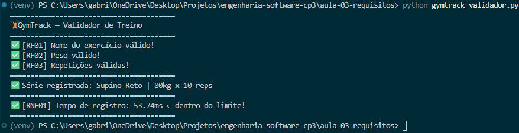

## Aula ES 03 - Requisitos Funcionais vs. Não-Funcionais

#### Código

Arquivo: [`aula-03-requisitos/gymtrack_validador.py`](aula-03-requisitos/gymtrack_validador.py)

O codigo implementado é sobre validar o registro de atividades fisicas executadas dentro de uma academia.

#### 🖥️ Execução

Output do codigo implementado acima, com saida executadas corretamentes para cada requisito funcional ou não funcional estabelecido antes da construção do código.