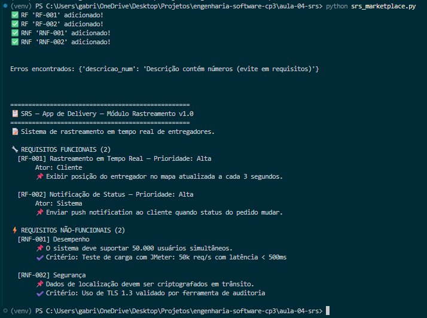

## Aula ES 04 - Documento de Especificação de Requisitos de Software

#### Código

Arquivo: [`(srs_marketplace.py`](srs_marketplace.py)

O código implementa um sistema simplificado de SRS (Software Requirements Specification), permitindo cadastrar, validar e organizar requisitos funcionais e não funcionais de um projeto de software.

#### 🖥️ Execução

O output exibe um relatório estruturado e visualmente organizado do documento SRS, apresentando os requisitos cadastrados, prioridades, critérios de aceitação e mensagens de validação de forma clara e elegante no terminal.