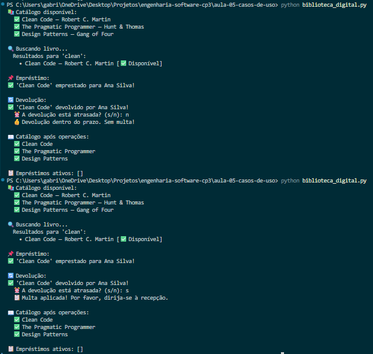

## Aula ES 05 - Diagramas de Casos de Uso

#### 📐 Diagrama

#### Código

Arquivo: [`(biblioteca_digital.py`](biblioteca_digital.py)

O código implementa um sistema simplificado de biblioteca digital baseado em casos de uso da UML, simulando operações como listagem de catálogo, busca de livros, empréstimo, devolução e aplicação de multas.

#### 🖥️ Execução

O output apresenta um fluxo visual organizado e intuitivo das operações da biblioteca, exibindo mensagens de status, validações e atualizações do catálogo de forma elegante e fácil de interpretar no terminal.