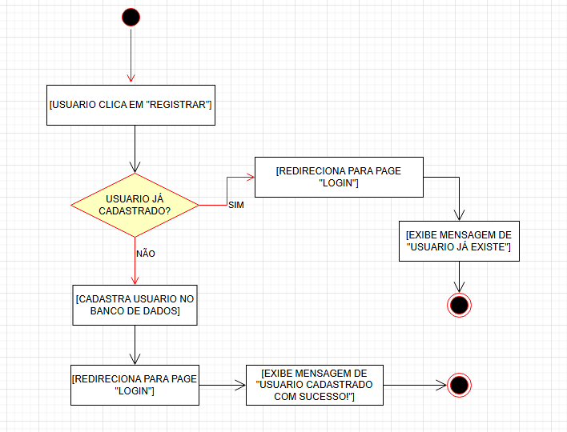
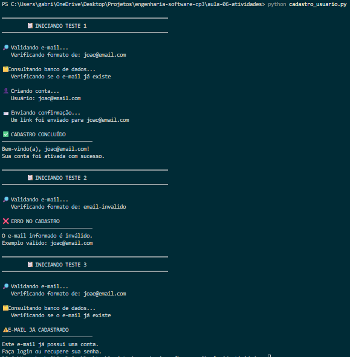

## Aula ES 06 - Diagramas de Atividades

#### 📐 Diagrama

#### Código

Arquivo: [`(cadastro_usuario.py`](cadastro_usuario.py)

O código implementa um sistema simples de cadastro de usuários em Python, realizando validação de e-mail, verificação de usuários já cadastrados e confirmação de cadastro, utilizando estruturas condicionais e funções para organizar o fluxo do sistema.

#### 🖥️ Execução

O output apresenta mensagens organizadas e intuitivas no terminal, exibindo cada etapa do processo de cadastro de forma visual, clara e fácil de compreender.