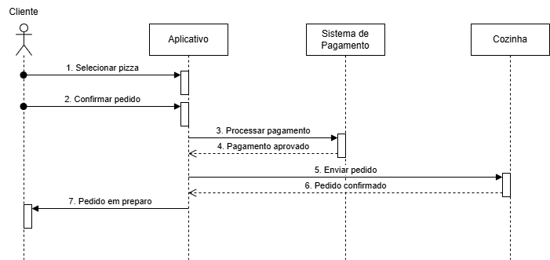
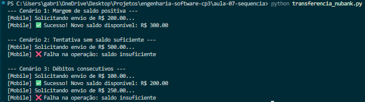

## Aula ES 07 - Diagramas de Sequencia

#### 📐 Diagrama

#### Código

Arquivo: [`(transferencia_nubank.py`](transferencia_nubank.py)

O código implementa um sistema simplificado de transferência bancária inspirado no Nubank, utilizando classes para representar o aplicativo, servidor e banco de dados. Durante a atividade, foi possível aprender conceitos de orientação a objetos, comunicação entre componentes do sistema e validação de saldo para aprovação ou reprovação de transferências.

#### 🖥️ Execução

O output apresenta de forma clara cada etapa da transferência, exibindo mensagens de aprovação ou recusa da operação, além do saldo restante após cada transação realizada.