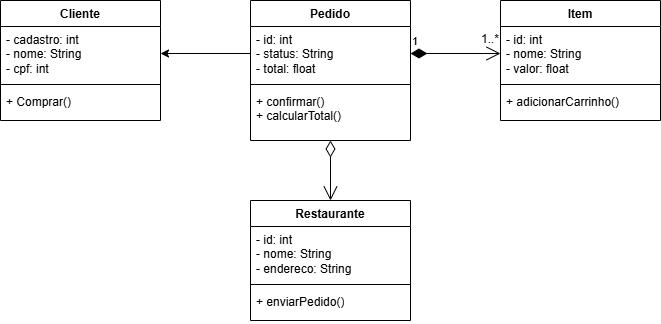
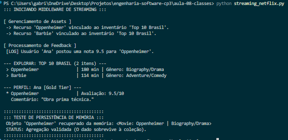

## Aula ES 06 - Diagramas de Classes

#### 📐 Diagrama

#### Código

Arquivo: [`(streaming_netflix.py`](streaming_netflix.py)

O código implementa uma arquitetura de streaming que replica fielmente as regras de relacionamento UML vistas no diagrama. Através dele, foi possível aprender na prática a diferença entre Composição (onde avaliações e inventários dependem de seus donos) e Agregação (onde os filmes existem e persistem de forma totalmente independente no sistema).

#### 🖥️ Execução

O output demonstra a simulação do sistema em funcionamento, exibindo o vínculo de mídias, o registro de avaliações dos usuários e, por fim, um teste de persistência que valida visualmente a sobrevivência do objeto independente após a destruição do seu catálogo.